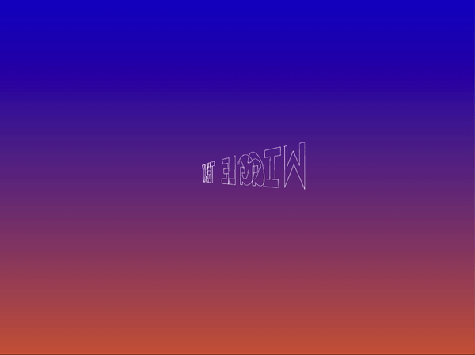
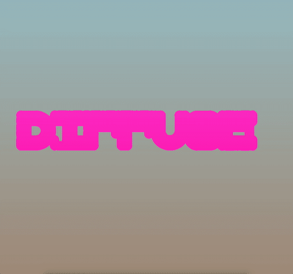

# Typo

quick repo to upload typography sketches.

- - - -
### 1) Wiggle sketch


### 2) Diffuse sketch



- - - -
## Getting Started

### 1) Wiggle sketch

Done on the 4 / 07 / 2019.<br/>

font Stockholm found [here](https://www.ffonts.net/Stockholm.font.download#). (not provided).

Controls are :<br/>
Noise  Depth on the letters :```depthNoise  = 300.0;```

Wiggle speed :```speedNoise  = 700.0; ```

Frequency of the speed :```freqNoise   = 0.001;```

Letters padding :```padding = dpi / 10;```

depth on letter segment :```depthLetterMoves = 10;```

amount of subsegments :```segmentsDivs = 5;```


### 2) Diffuse sketch

Done on the 8 / 07 / 2019.<br/>

font Stockholm found [here](https://www.ffonts.net/Stockholm.font.download#). (not provided).

Code inspired by [Daniel Shiffman's tutorial](https://www.youtube.com/watch?v=BV9ny785UNc).

#### Controls
Controls are :<br/>
Reset seeding : Press ``` s ```
Show / Hide GUI : Press ```g```

GUI : <br/>
differential on A : ```DiffA``` <br/>
differential on B : ```DiffB``` <br/>
coefficient on the close neighbours :```kernel```: <br/>
      | i - 1 | i | i + 1 |
      |-------|---|-------|
j - 1 |  0.15 |0.09| 0.15  |
  j   |  0.09 | -1 | 0.01|
j + 1 |  0.15 |0.09| 0.15  |
      |-------|---|-------|
